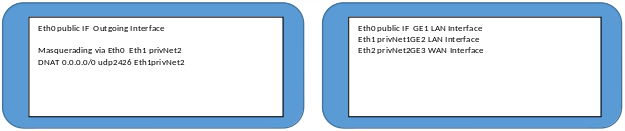

# velocloud-exoscale-virtual_edge
## Deployment of VeloCloud virtual Edge on Exoscale
\#A1 Digital Deutschland GmbH, 2019<br>
\#sd-wan@a1.digital 
## Requirements 
Prequisites for deploying a virtual VeloCloud Edge to Exoscale are.
- use of A1 Digital SD WAN with valid license
- use of the Exoscale platform with vailid payment
- user with Administrator role for configuration on both platforms
- egoscale CLI tool (alternatively)

## Introduction
The virtual VeloCloud Edge template are using a interface mapping table as following.

| Interface Name by OS | Interface Name by VeloCloud | Description |
|----------------------|-----------------------------|-------------|
| Eth0 | GE1 | Switched Port LAN |
| Eth1 | GE2 | Switched Port LAN |
| Eth2 | GE3 | WAN Port (DHCP by default) |
| Eth3 | GE4 | WAN Port (DHCP by default) |

An instance on Exoscale always uses the Eth0 interface as a WAN interface. 
All subsequent configurable interfaces are Privat Network interfaces. They having no direct
access to the Internet. The compute instance will using a interface table as following.

| Interface Name | Descrition |
|----------------|------------|
| Eth0 | Default Interface with Public IP, deployed by Exoscale |
| Eth1 | Private Network Interface with or w/o DHCP Service |
| Eth2 | Private Network Interface with or w/o DHCP Service |

Neither the interface ranking on Exoscale, nor the mapping table of VeloCloud can be modified.
In order to be able to use the VeloCloud Edge on Exoscale, an instance is used to correct the interface ranking. The instance uses an operating system with low resource requirements and routing and firewall functionality.




### Hypervisor      VeloCloud Edge
```
eth0 Public     eth0 - GE1 LAN
eth1 Privat     eth1 - GE2 LAN
eth2 Privat     eth2 - GE3 WAN 
eth3 Privat     eth3 - GE4 WAN
```
## Solution
Create a simple Router (instance type micro) to hiding the Velocloud Edge.<br>
```
