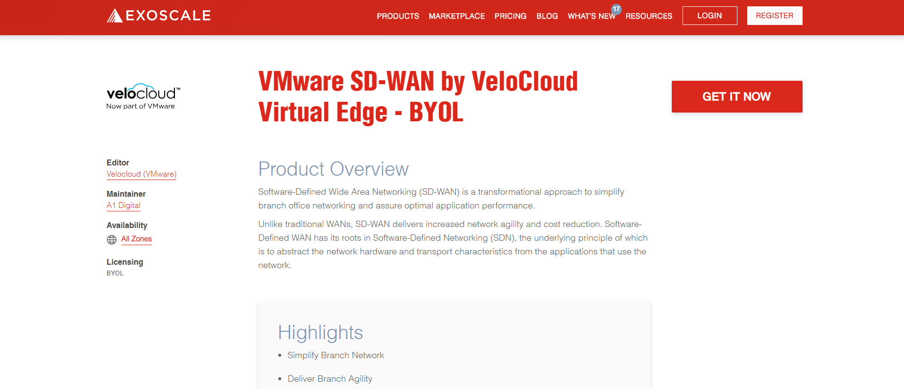
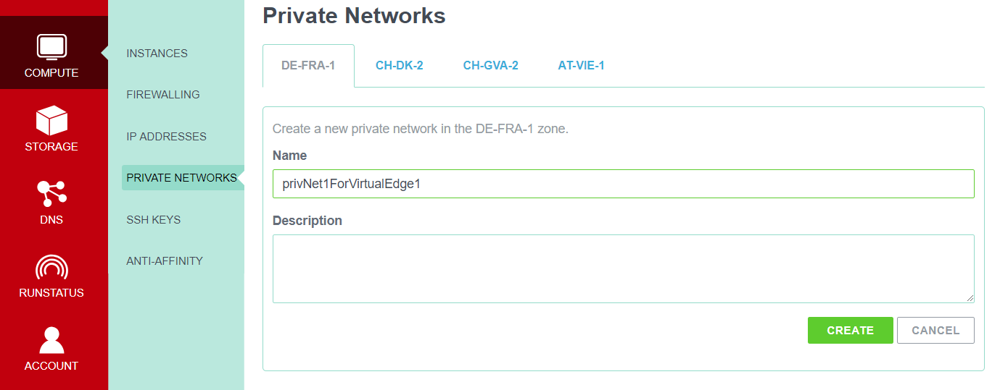
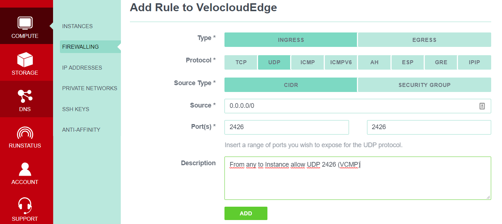
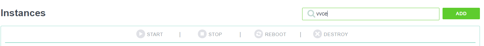
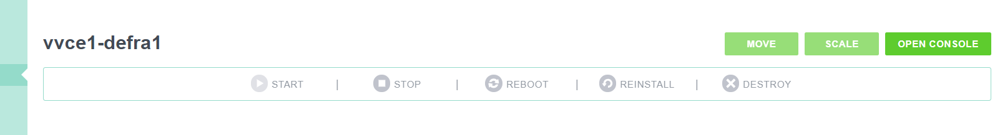

# Deployment of VeloCloud virtual Edge on Exoscale

* [Requirements](#requirements)
* [Introduction](#introduction)
* [Setup](#setup)
* [Additional Notice](#additional-notice)

## Requirements
Prequisites for deploying a virtual VeloCloud Edge to Exoscale are.

- use of A1 Digital SD WAN with valid license
- use of the Exoscale platform with vailid payment
- user with Administrator role for configuration on both platforms
- Exoscale CLI tool (alternatively)

## Introduction
The virtual VeloCloud Edge template are using a interface mapping table as following.

| Interface Name by OS | Interface Name by VeloCloud | Description |
|----------------------|-----------------------------|-------------|
| Eth0 | GE1 | Switched Port LAN |
| Eth1 | GE2 | Switched Port LAN |
| Eth2 | GE3 | WAN Port (DHCP by default) |
| Eth3 | GE4 | WAN Port (DHCP by default) |

An instance on Exoscale always uses the Eth0 interface as a WAN interface.
All subsequent configurable interfaces are Privat Network interfaces. They having no direct
access to the Internet. The compute instance will using a interface table as following.

| Interface Name | Descrition |
|----------------|------------|
| Eth0 | Default Interface with Public IP, deployed by Exoscale |
| Eth1 | Private Network Interface with or w/o DHCP Service |

Neither the interface ranking on Exoscale, nor the mapping table of VeloCloud can be modified.
In order to be able to use the VeloCloud Edge on Exoscale, a reconfiguration is needed to correct the interface ranking.

## Setup
The easiest way to deploy a VeloCloud Edge is using the installation from [Exoscale Marketplace][7cc4f79c].

  [7cc4f79c]: https://www.exoscale.com/marketplace "Exoscale Marketplace"



Before click at "Get It Now" button, please configure the dependencies as first.
Start by configuring private network for your zone. From the portal, click `Compute` -> `Private Networks` -> `Zone` -> `Allocate`



For deployment behind the VeloCloud Edge, you need one private network. In the Exoscale CLI you can create the private networks with the following command.

```
[user@host ~ ]$ exo privnet list
[user@host ~ ]$ exo privnet create privNet1ForVirtualEdge1 -z de-fra-1
```

Next, we recommend creating a firewall rule to protect the instances. For administration purposes, **SSH access can't be is used from oustide**. The VeloCloud Hub site functionality requires a Ingress rule for the VCMP protocol (UDP 2426). Egress, the protocols HTTPS (tcp 443), NTP (tcp / udp 123) and VCMP (udp 2426) are required. The firewall configuration in Exoscale is cross-zone.
`Compute` -> `Firewalling` -> `Add`



In the Exoscale CLI you can create the firewall rules with the following command.

```
[user@host ~ ]$ exo firewall list
[user@host ~ ]$ exo firewall create VelocloudEdge
[user@host ~ ]$ exo firewall add VelocloudEdge -c “0.0.0.0/0”  -p udp -P 2426 -d “From any to Instance allow UDP 2426 (VCMP)”
```

Now move on to creating the virtual edge. Click at "Get It Now" button at "VMware SD-WAN by VeloCloud Virtual Edge - BYOL" on Exoscale Marketplace.
[(VMware SD-WAN by VeloCloud)][a86f1bc7]

[a86f1bc7]: https://www.exoscale.com/marketplace/listing/vmware-sd-wan-by-velocloud-virtual-edge-byol/ "Exoscale Marketplace"


Add all needed values. Select your zone and add the preconfigured private network and security groups (firewall rules). Click to Create.

| Properties | Values |
|------------|--------|
| Hostname | e.g. vvce1-defra1 |
| Template: | VMware SD-WAN 3.2.1 BYOL |
| Instance Type: | Medium |
| Disk: | 10GB |
| Keypair: | your ssh public key or default |
| Private Networks: | PrivNet1ForVirtualEdge |
| Security Groups: | VeloCloudEdge |
| User Data: | not working |


Finally you need access to the Velocloud Edge console. Select `Compute` -> `Instances`. Enter the name of the newly created edge, e.g. vvce1-defra1.



Select the **Name** of the instance filter list and then select `Console`.



Use console window to login as user *root* with password *velocloud*.

Reconfigure the interface settings as following.
```
[user@host ~ ]$ ip link set br-network0 down
[user@host ~ ]$ brctl delbr br-network0
[user@host ~ ]$ ip link set eth0 dynamic on
[user@host ~ ]$ udhcpc -i eth0
```
Now activate the Edge with the *activate.py* script.
```
[user@host ~ ]$activate.py -s vco.hostname Activation-Key
```

The Edge is now enabled and can be administered through VeloCloud Orchestrator. You can connect your server instances to the SD WAN via the created private network PrivNet1ForVirtualEdge1.

## Additional Notice
Please check all script entries of their correctness. The IDs used here in the guide are also carefully checked for accuracy. If you have any questions or comments about this guide, please contact [A1 Digital SD-WAN team](mailto:sd-wan@a1.digital).
