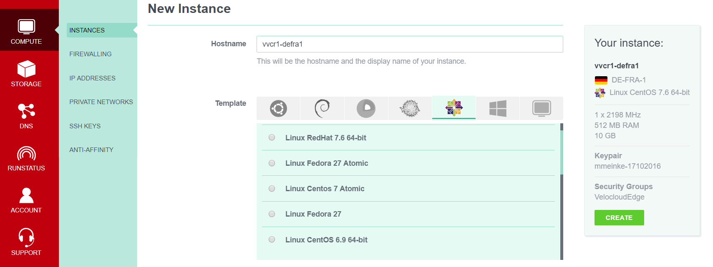

# velocloud-exoscale-virtual_edge
## Deployment of VeloCloud virtual Edge on Exoscale
\#A1 Digital Deutschland GmbH, 2019<br>
\#sd-wan@a1.digital 
## Requirements 
Prequisites for deploying a virtual VeloCloud Edge to Exoscale are.
- use of A1 Digital SD WAN with valid license
- use of the Exoscale platform with vailid payment
- user with Administrator role for configuration on both platforms
- egoscale CLI tool (alternatively)

## Introduction
The virtual VeloCloud Edge template are using a interface mapping table as following.

| Interface Name by OS | Interface Name by VeloCloud | Description |
|----------------------|-----------------------------|-------------|
| Eth0 | GE1 | Switched Port LAN |
| Eth1 | GE2 | Switched Port LAN |
| Eth2 | GE3 | WAN Port (DHCP by default) |
| Eth3 | GE4 | WAN Port (DHCP by default) |

An instance on Exoscale always uses the Eth0 interface as a WAN interface. 
All subsequent configurable interfaces are Privat Network interfaces. They having no direct
access to the Internet. The compute instance will using a interface table as following.

| Interface Name | Descrition |
|----------------|------------|
| Eth0 | Default Interface with Public IP, deployed by Exoscale |
| Eth1 | Private Network Interface with or w/o DHCP Service |
| Eth2 | Private Network Interface with or w/o DHCP Service |

Neither the interface ranking on Exoscale, nor the mapping table of VeloCloud can be modified.
In order to be able to use the VeloCloud Edge on Exoscale, an instance is used to correct the interface ranking. The instance uses an operating system with low resource requirements and routing and firewall functionality.

|    **Router**                                  |    **VeloCloud Edge**                                    |
|------------------------------------------------|----------------------------------------------------------|


## Setup
As first creating the router instance. You can use the web portal of Exoscale or otherwise using the command-line tool Egoscale. The installation sources and documentation for Egoscale can be found on the website https://exoscale.github.io/egoscale/.

Start by configuring private networks for your zone. From the portal, click `Compute` -> `Private Networks` -> `Zone` -> `Allocate`


For deployment, you need 2 Private Networks. In the egoscale CLI you can create the private networks with the following command.
```
[user@host ~ ]$ exo privnet list
[user@host ~ ]$ exo privnet create privNet1ForVirtualEdge1 -z de-fra-1 
[user@host ~ ]$ exo privnet create privNet2ForVirtualEdge1 -z de-fra-1 
```

Next, we recommend creating a firewall rule to protect the instances. For administration purposes, SSH access to the router is used. Restrict this access to the source networks you are using. The VeloCloud Hub site functionality requires a DNAT for the VCMP protocol (UDP 2426). Initially the protocols HTTPS (tcp 443), NTP (tcp / udp 123) and VCMP (udp 2426) are required. The firewall configuration in Exoscale is cross-zone.
`Compute` -> `Firewalling` -> `Add`


In the egoscale CLI you can create the firewall rules with the following command.
```
[user@host ~ ]$ exo firewall list
[user@host ~ ]$ exo firewall create VelocloudEdge
[user@host ~ ]$ exo firewall add VelocloudEdge -c “0.0.0.0/0”  -p udp -P 2426 -d “From any to Instance allow UDP 2426 (VCMP)”
[user@host ~ ]$ exo firewall add VelocloudEdge -c “17.17.17.17/32”  -p tcp -P 22 -d “From my Network to Instance allow ssh”
```

Now create the instance as following. `Compute` -> `Instances` -> `Add`



The following informations are required. 
| Properties | Values |
|------------|--------|
| **Template:** | Linux CentOS 7.6 64-bit |
| **Instance Type:** | Micro |
| **Disk:** | 10GB |
| **Keypair:** | your ssh public key or default |
| **Private Networks:** | PrivNet2ForVirtualEdge |
| **Security Groups:** | VeloCloudEdge |
| **User Data:** |  Additionally use the [Cloud-Init Script](cloud-init/router_default.yml) of the A1 Digital to create the instance. Edit the parameters (<foo bar>) in the script to your desired values. |


